<p align="center">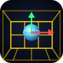</p>

# Holodeck

**[▶ Play it in your browser](https://maxfridbe.github.io/HOLODECK/)** — built from `main` and deployed to GitHub Pages by the release workflow.

Holodeck is a 3D scene editor / simulator: you float inside a holographic grid, load models and scenes, select objects, and move, scale and rotate them with on-screen handles. It is a Rust/[Bevy](https://bevyengine.org) port of the original C++/OpenGL project (VRUPL, 2004–05); the original sources are kept in [`cpp/`](cpp/) for reference. The build system, packaging and CI come from [GameBase](https://github.com/maxfridbe/GameBase), so Holodeck ships to **Linux, Windows, macOS (Apple Silicon), Android and the browser** from one crate.

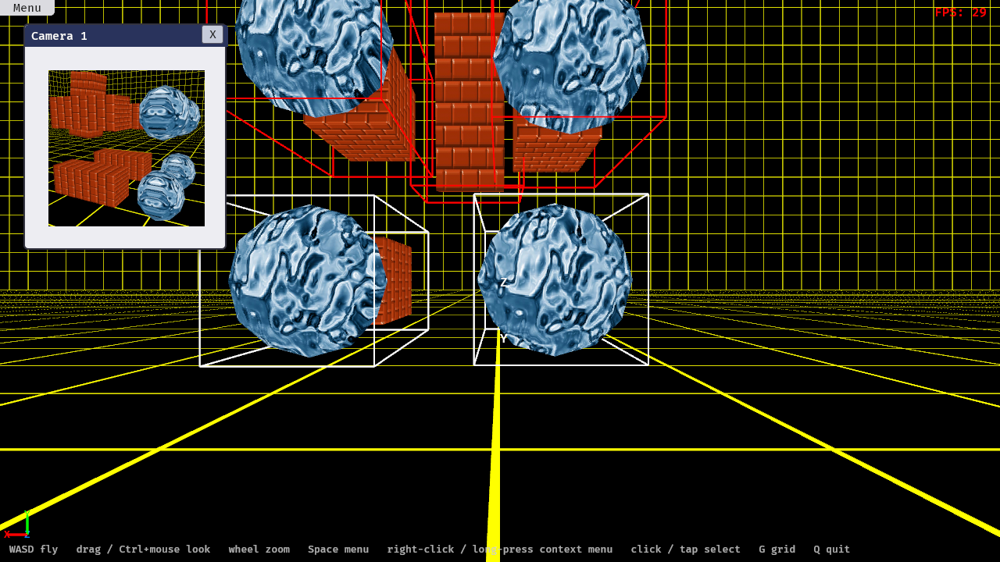

## Screenshots

| | |
|---|---|
| 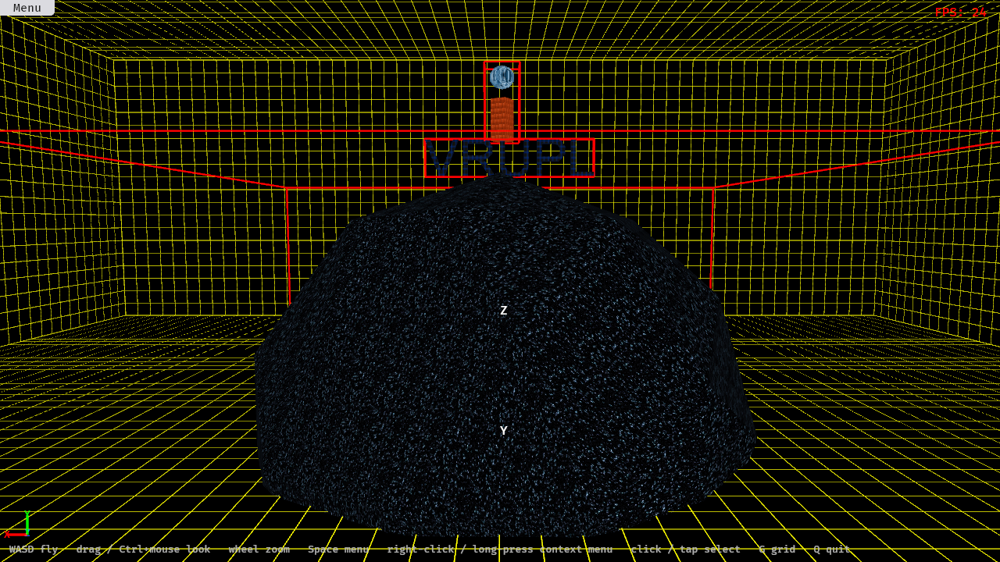 **demo.world** from across the holodeck | 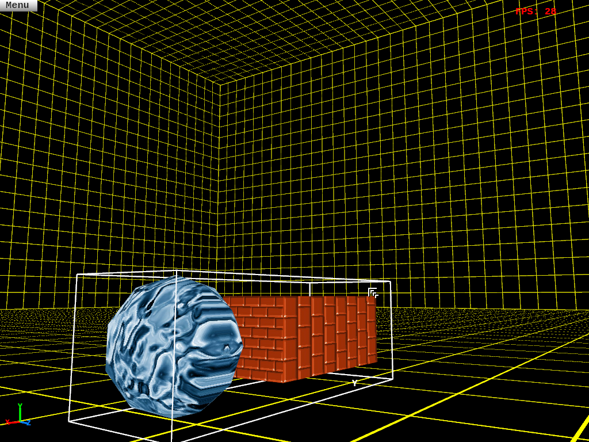 **A loaded `.3dbin`** (blueEye) on the holodeck floor |
| 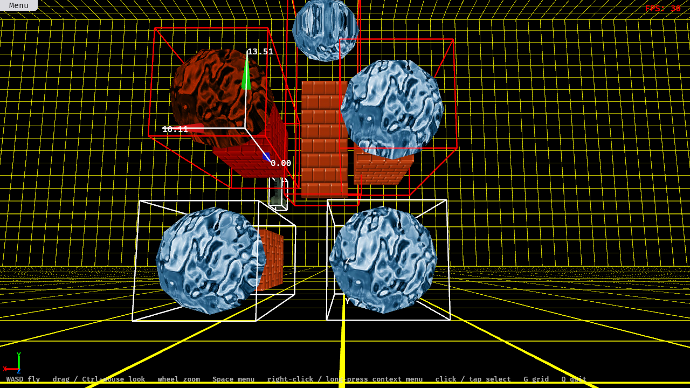 **Translate handles** on a selected object (values show its position) | 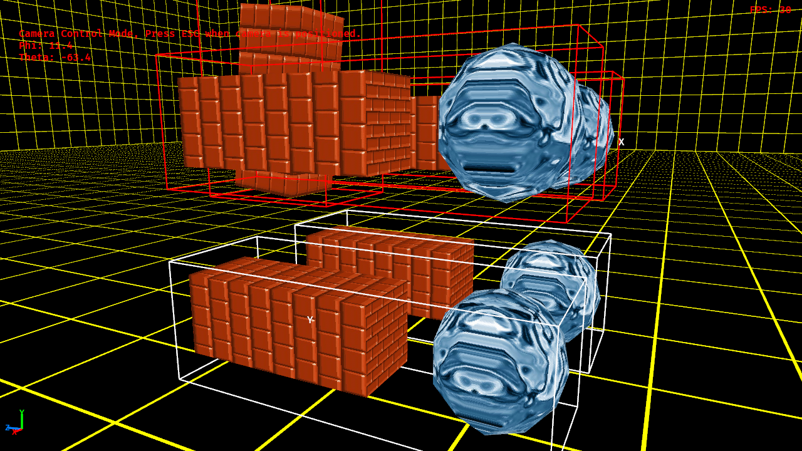 **Camera control**: flying the placed camera (Esc to return) |
| 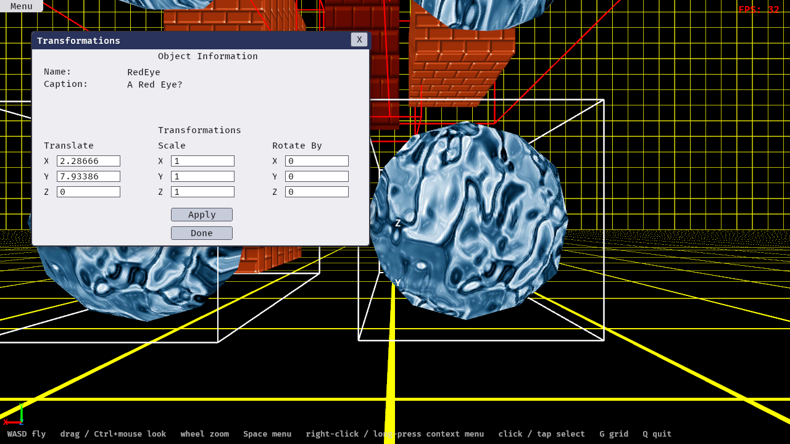 **Properties**: typed-in translate / scale / rotate | 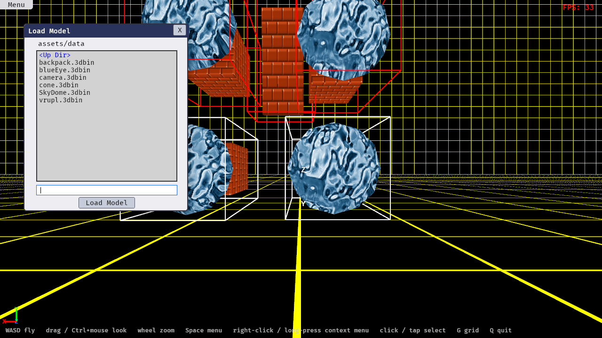 **Load Model** dialog with the bundled models |
| 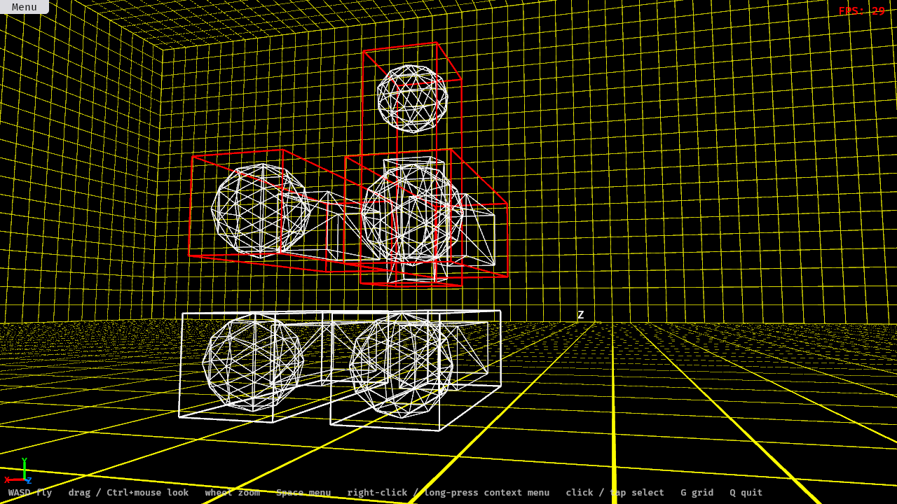 **Wireframe** mode | 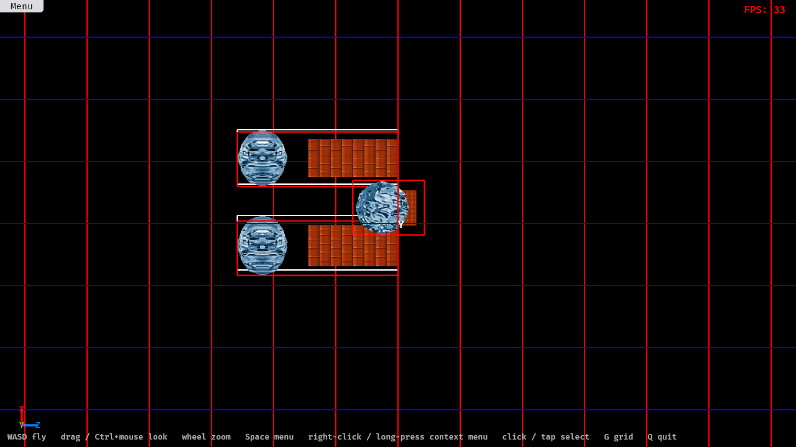 **Top view** (orthographic, with the inner grid) |
| 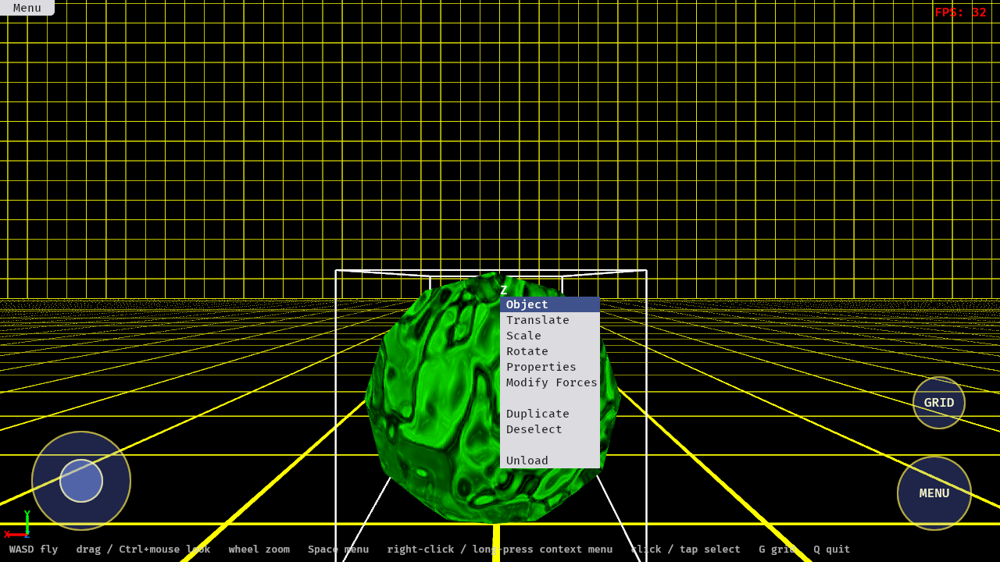 **Touch**: long-press for the context menu (stick and buttons on screen) | 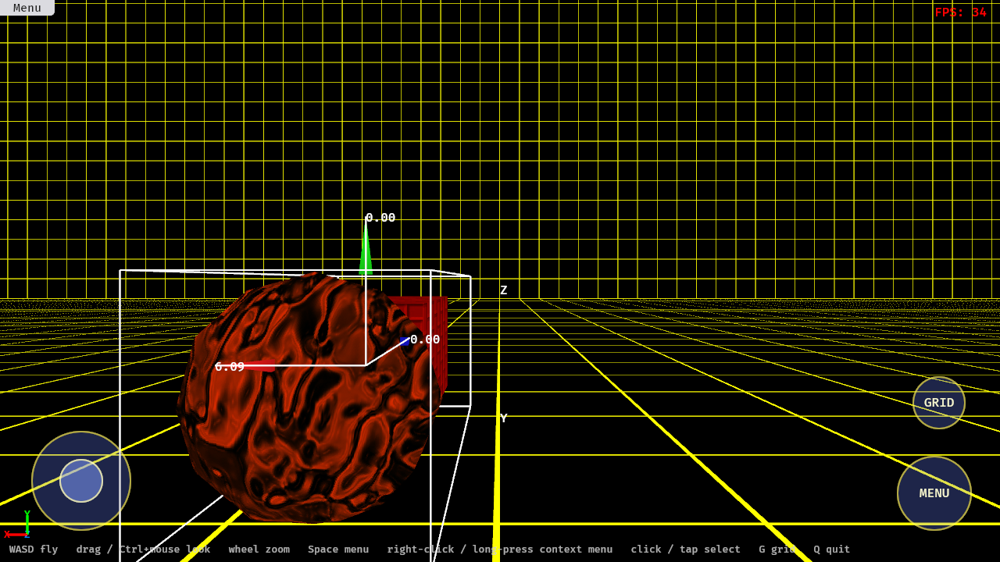 **Touch**: dragging the X handle moved the object 6.09 units |

## Playing

Start with **Space** to open the menu, then **Scene → Open** and pick `demo.world` (or `fixed.world` for objects you can grab). Models and scenes bundled with the game:

| Kind | Files |
|------|-------|
| Models (`.3dbin`) | `backpack`, `blueEye`, `camera`, `cone`, `SkyDome`, `vrupl` |
| Scenes (`.world`) | `demo`, `fixed`, `fixed2`, `scenex`, `test`, `testing`, `world` |

| Input | Action |
|-------|--------|
| **W A S D** | Fly where you look: 15 units/s, ramping to 60 while held. You start at eye height and stay inside the holodeck, never lower than 2 units above the floor |
| Left-drag on empty space | Look around (also one-finger drag on touch screens) |
| **Ctrl + mouse** | Look around without clicking (desktop captures the pointer) |
| Mouse wheel | Field of view (zoom in orthographic views) |
| Left-click | Select the object under the pointer (click without dragging); drag a handle to use it |
| Right-click | Context menu for what is selected (Translate / Scale / Rotate / Properties / Modify Forces / Duplicate / Deselect / Unload) |
| **Space** | Show / hide the menu bar |
| **G** | Toggle the holographic grid |
| **Q** | Quit (asks first) |
| Enter / Esc | Accept / cancel the front dialog. Tab moves between fields |

**Touch screens** (phones, tablets, the browser on a touch device) — the same on-screen controls as DarkMessenger appear as soon as you touch the screen:

| Touch | Action |
|-------|--------|
| Stick (bottom-left) | Fly; push further to go faster |
| Drag anywhere else | Look around (a second finger looks while the first does something else) |
| Tap | Select, press buttons and menus, pick list entries (double-tap to open a file) |
| Long press | Context menu (the right-click menu) |
| Drag a handle | Move / scale / rotate the selected object |
| **MENU** / **GRID** buttons | Show the menu bar / toggle the grid |

The controls hide again when a key is pressed. The whole UI scales with the window (laid out for 1280×720), so it stays the same size relative to the screen on a phone or a 4K monitor.

**Menus** — *File* (Connect, Exit) · *Edit* (Duplicate) · *Settings* (Grid colours) · *View* (3d, Front, Back, Left, Right, Top, Bottom, HoloGrid, Wireframe, Inner Grid) · *Scene* (New, Save, Open, Add World Force) · *Model* (Load, Unload).

**Cameras** — the camera object at the side of the room (it starts aimed at the middle) can be selected: **View** opens a live picture-in-picture window showing what it sees (top screenshot), **Control** flies it (Esc to finish), **Translate** moves it.

**Handles** — after choosing Translate/Scale/Rotate from the context menu, arrows (translate, world axes), cubes (scale, the object's own axes) or rings (rotate, world axes) appear around the object. Drag one and the object follows the pointer. Handles keep a constant size on screen. Faint boxes around every object show its world-space bounding box; a box turns red while it overlaps another.

**Forces** — *Scene → Add World Force* defines named forces; *Modify Forces* on an object attaches them so the object moves under simple point-mass physics.

**Networking** — *File → Connect* talks to the multi-user server (TCP 1307, same wire format as the C# server in the original project). Not available in the browser.

## Running and building

```bash
./setup_env.sh --check   # see what your machine is missing
./run_linux.sh           # play natively (release build); `./run_linux.sh debug` for debug
cargo test               # unit tests (parsers, geometry, UI logic, networking, ...)
./build_web.sh           # -> target/web_dist  (then: python3 -m http.server -d target/web_dist 8080)
./build_windows.sh   ./build_macos.sh   ./build_cargo_apk.sh   # other platforms
```

The full script list, platform notes, macOS signing caveats and the Android/Gradle paths are exactly as in GameBase — see its README. `game.env` holds this game's identity (`holodeck`, `Holodeck`, `com.vrupl.holodeck`).

### Versions and releases

Versions are `YY.MMDD.##` — for example `26.0929.03` is the third release of 29 Sep 2026. Every push to `main` runs [`release.yml`](.github/workflows/release.yml), which

1. works out the next version (today's date; `##` continues from the existing `v<YY.MMDD>.##` tags),
2. builds Linux, Windows, macOS, Android and web,
3. publishes a GitHub Release `v<version>` with all artifacts and deploys the web build to GitHub Pages,
4. commits the version back to `version.txt`, `Cargo.toml` and the Gradle files (`[skip ci]`).

`./increment_version.sh` does the same locally; `./increment_version.sh --print` shows the next version. Cargo requires semver (no leading zeros) and cargo-apk stores each version part in a byte, so `Cargo.toml` carries the date as `YY.M.D` with the release number as build metadata (`26.0929.03` → `26.9.29+03`); tags, release names and `version.txt` use the padded form.

**One-time setup:** enable GitHub Pages under *Settings → Pages → Source: GitHub Actions* so the first deploy can publish the playable build.

### Icons

[`web/favicon.svg`](web/favicon.svg) is the one source for every icon:

| Where | What |
|-------|------|
| Browser | the SVG itself (favicon) |
| Android 8+ | a vector adaptive icon hand-drawn from the SVG: `assets/android-res/drawable/ic_launcher_{background,foreground}.xml` + `mipmap-anydpi-v26/ic_launcher.xml`. Solid colours only, because cargo-apk compiles with `aapt`, which cannot read gradients |
| Android 7 and older | `assets/android-res/mipmap-*/ic_launcher.png`, rendered from the SVG |
| macOS | `assets/macos-icon.png` (1024px), rendered from the SVG |

After editing the SVG run `./make_icons.sh` (needs `cargo install resvg --locked`) and update the vector foreground to match. Both Android build paths use `assets/android-res` (`resources = ...` in `Cargo.toml`, `res.srcDirs` in `app/build.gradle`).

### Development hooks

`HOLODECK_SCRIPT` runs scripted steps for smoke tests and screenshots (see `src/devtools.rs`):

```bash
HOLODECK_SCRIPT="scene:fixed;cam:5,10,-60,0,0;wait:60;select:0;manip:translate;wait:5;shot:out.png;wait:5;exit" cargo run --release
```

## How it is organised

```
src/lib.rs        app wiring (plugins, main camera)            src/main.rs  desktop entry point
src/objects/      3dbin + scene readers, models, bounding boxes, picking, manipulator
src/camera.rs     camera rigs, placed camera objects           src/view.rs  viewport / projection modes
src/grid.rs       holographic grid                             src/input.rs flight, look, hotkeys
src/ui3d/         menus, windows, text/list boxes, dialogs     src/net/     TCP client
src/physics/      forces and point-mass nodes                  assets/data/ bundled models and scenes
```

Original module → port: `adt` (custom string/list/hash containers) → Rust std · `math` → `glam` + `src/math.rs` · `win32` (window, DirectInput, timing) → Bevy · `holodeck` → `lib/view/input/grid` · `objects` → `src/objects` · `ui3d` → `src/ui3d` (rebuilt on `bevy_ui`) · `net` → `src/net` · `physics` → `src/physics`. Not ported: the C# `Server` and `packer` tools and the 3ds converter (kept in `cpp/`; the packer's format spec is implemented by `src/objects/format.rs`).

## Differences from the original

Fixed, on purpose:

* **Scale.** The original room was 1000 units a side with grid lines every 100 units and the floor 500 units below the objects, while models are 2–25 units across — everything floated in the middle of a vast empty box. The room is now sized to the content (600 × 600, 200 high, lines every 10 units), the floor is where objects rest (y = −5), and you start at eye height on it.
* **Speeds.** Flying started from a standstill and crept up at 1 unit/s² to 120 units/s; now 15 → 60 units/s. Mouse/finger look turns a fixed 0.2° per pixel (the original's table, tuned for raw DirectInput counts, turned up to a radian per frame on a fast swipe). The wheel is normalised, so a browser's pixel scrolling no longer slams the field of view to its limit.
* **You can't leave the grid** (or sink into the floor); orthographic views still look at the room from outside.

* **Bounding boxes in negative space.** The C++ seeded the "max" corner with `FLT_MIN` (the smallest *positive* float), so any box lying in negative space got a max of ~0 — the manipulator "grabbed the edge of the box at the origin". Boxes are now fitted correctly (regression-tested).
* **Manipulator size.** Handles were sized from the *unscaled model-space* box, measured to the wrong point with a Manhattan distance, and the object's extent was multiplied by the view distance as well — hence "excessively large", worst for the rotate tool. Now: distance is to the object's real world-space centre, only the handle geometry scales with distance, and rotate rings hug the object but are capped.
* **Dragging.** Handles used to convert mouse speed into movement per frame (frame-rate dependent). Dragging now tracks the pointer along the axis / around the ring.
* Mouse look is **Ctrl + mouse** rather than always on: the original turned the camera on every mouse movement while a visible pointer moved around, which made clicking things very hard.
* Scene files: older encodings (Euler angles, run-together matrix rows) that the C++ loader could not read now load; scene cameras are not saved.
* Physics: `Reset` really resets, collisions conserve momentum, forces can be removed by name and the "attach force" UI is finished. `Model::Close` promotes a copy when its original is removed.
* Memory/UB fixes, no leaked matrices, no dangling camera pointers after loading a scene, errors shown in message boxes instead of crashes.

## License

Apache-2.0 — see [LICENSE](LICENSE).
